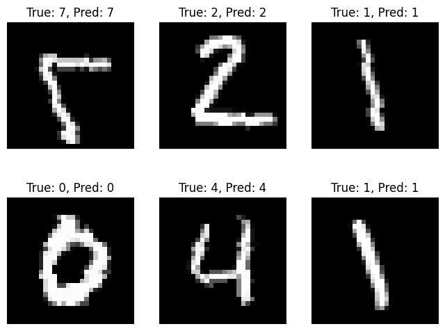

# Advanced CNN-Based Handwritten Digit Recognition using MNIST

## Overview

This project implements a Convolutional Neural Network (CNN) model for handwritten digit recognition using the MNIST dataset. The model is built with PyTorch, and advanced techniques such as data augmentation, batch normalization, and dropout are employed to improve generalization and performance.

## Features
- **Convolutional Neural Network**: Three convolutional layers with Batch Normalization and Max Pooling.
- **Regularization**: Dropout is applied to prevent overfitting.
- **Data Augmentation**: Random horizontal flipping and rotation to enhance model robustness.
- **Learning Rate Scheduling**: Adaptive learning rate during training with a step scheduler.
- **Metrics**: Accuracy, F1 Score, Confusion Matrix.

## Results

- **Training Loss**: The training loss steadily decreases over epochs, indicating the model's learning process.
- **Test Accuracy**: The model achieves an accuracy of **98.84%** on the MNIST test dataset.
- **F1 Score**: Weighted F1 score of **0.9884**, showcasing its strong performance across all classes.

### Sample Results:

- **Confusion Matrix:**

  

- **Training Loss Curve:**

  

- **Sample Test Predictions:**

  

## How to Run the Project

1. **Install the required dependencies:**
   - Install dependencies using `pip`:
     ```
     pip install torch torchvision matplotlib seaborn scikit-learn
     ```

2. **Run the Python script:**
   - Use the provided Python script to train the model:
     ```
     python cnn_mnist_digit_recognition.py
     ```

3. **Evaluate the model:**
   - The model will output accuracy, F1 score, and display a confusion matrix along with predictions for test samples.

## Model Architecture

- **Convolution Layers**: Three layers with 32, 64, and 128 filters, each followed by batch normalization and ReLU activation.
- **Fully Connected Layers**: After flattening, the features are passed through a 256-neuron fully connected layer.
- **Dropout**: Applied before the final output layer to reduce overfitting.
- **Output Layer**: The final layer consists of 10 neurons representing the digit classes (0-9).

## Datasets

- The MNIST dataset is used, consisting of 60,000 training images and 10,000 test images of handwritten digits (0-9).

## Future Work

- Extend the current architecture to multi-character recognition using more complex datasets like COCO-Text.
- Explore more advanced neural network architectures like Recurrent Neural Networks (RNNs) or Transformer models for sequence-based tasks.

## License

This project is licensed under the MIT License.
